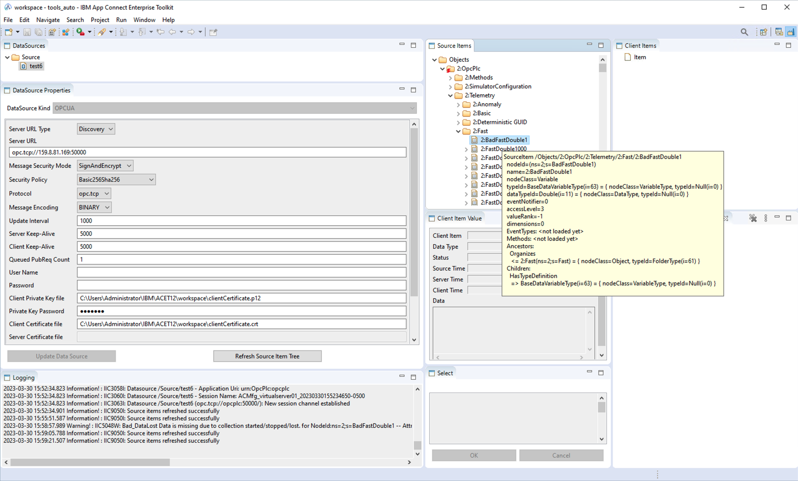
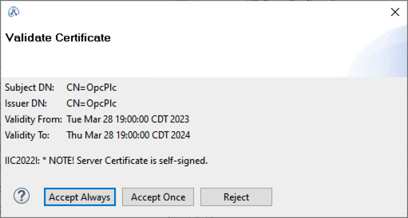

# Testing the IBM Manufacturing pack for IBM App Connect Enterprise

IBM ACE is also available with an extension supporting the [OPC UA](https://en.wikipedia.org/wiki/OPC_Unified_Architecture) interface, as a client.

For testing purpose an OPC UA server (generating samples) is needed.

We can use the OPC PLC server.

The communication can be either un-encrypted (for tests only) or encrypted, but in that case X509 certificates must be put in place (both sides).

> **Note:** The Makefile is intended to be run on a Unix-like system (macOS, Linux)



[Nice IBM Performance Report here](https://www.ibm.com/support/pages/ibm-app-connect-manufacturing-v20-performance-reports).

## ACE: Configuration

In some cases, the `Create Data Source` button in the ACE manufacturing view stays greyed out.

In this case:

1. Make sure you have created a data source in the folder above the data source properties, and that it is selected.

2. If that persists, close the toolkit, and restart. Eventually, the button shall be black.

### Without Encryption

For testing purpose only, it is possible to register a server without encryption and authentication.
In this case, select `None` for both `Message Security` Mode and `Security Policy`
No certificate shall be configured for this mode, but the server shall be configured to support it.

### Client Certificate

In production, Security will be used, this requires certificates on both the client and server.

### Comments on documentation

A few comments on the ACE documentation:

- The ACE OPC UA client requires: The certificate's Private Key, the Key's passphrase, and the certificate.
- The documentation provides the steps to generate those. (used in the script)
- The documentation talks about "[PEM](https://en.wikipedia.org/wiki/Privacy-Enhanced_Mail)" format for both.
- The method proposed in documentation shows a PKCS12 container is generated.
- The UI tells, for the key: Client Private Key in pem file (BASE64)

In fact, the values to provide are:

- **Client Private Key file** : Expects the [PKCS12](https://fr.wikipedia.org/wiki/PKCS12) container, not PEM BASE64
- **Private Key password** : the password for the PKCS12 container
- **Client Certificate file** : The certificate in PEM format

If the key is not provided in the PKCS12 container, then the following error is logged:

```text
ERROR! IIC2037E: Caught exception when trying to load the client certificate and key from C:\...\clientCertificate.crt and C:\...\clientCertificate.key respectively, for datasource /Source/xxx. stream does not represent a PKCS12 key store
```

The PKCS12 container (with both the key and certificate) can be dumped with:

```bash
openssl pkcs12 -info -in build/clientCertificate.p12 -nodes -password pass:_pass_here_
```

### Generation of client certificate

A Makefile is provided here to generate a simple self-signed certificate in the required format.

First initialize, execute `make`

This creates the folder `private` and file `private/config.env`

Edit this file and fill specific information:

```bash
CLIENT_ADDRESS=192.168.0.100
SERVER_ADDRESS=192.168.0.101
PASSPHRASE=_your_passphrase_here_
```

Then generate the certificate and private key as specified in the [ACE documentation](https://www.ibm.com/docs/en/app-connect/12.0?topic=source-generating-self-signed-ssl-certificate):

```bash
make
```

Generated files are located in folder `build`.

### Server certificate

The ACE OPCUA client allows (for testing) to accept the server certificate manually:



## OPC PLC server: Some details

In order to simulate the manufacturing side, a simulator can be used.
We use here the [OPC PLC server](https://github.com/Azure-Samples/iot-edge-opc-plc).

The current working directory in the container is : `/app`, as can be seen in the log:

```text
[16:10:16 INF] Current directory: /app
[16:10:16 INF] Log file: /app/818f92dc8d1f-plc.log
[16:10:16 INF] Log level: info
[16:10:16 INF] OpcPlc v2.8.2 starting up ...
```

So the script sets this variable: `container_app_folder`

The default sub folder that stores PKI files is: `pki`, so the script maps this folder to keep persistency: `container_pki_folder`

If no server certificate is provided, the server generates a self signed certificate containing the hostname (of the container, so we fix the value).

Also, we configure the server to accept the client certificate: copy the crt file (certificate PEM file) to the folder: `pki` which is shared with the container.
The startup script is given the path to the client certificate to add it to the trusted store.

```bash
make deploy
```

## Server startup

The startup script is provider for convenience: `start_opc.sh`

The configuration in this startup script allows connection from client using either:

- Message Security Mode = SignAndEncrypt
- Security Policy = Basic256Sha256

or

- Message Security Mode = None
- Security Policy = None

### Note on server generated self signed certificate

Note that the server runs in the container, which has a hostname defaulting to the container id.
So default certificates would be generated with that changing hostname.
And this will make subsequent start fail due to the changing name.
So we fix the container host name, so that the generated server certificate can be re-used.
(in case we need it on the client side).
