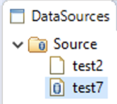
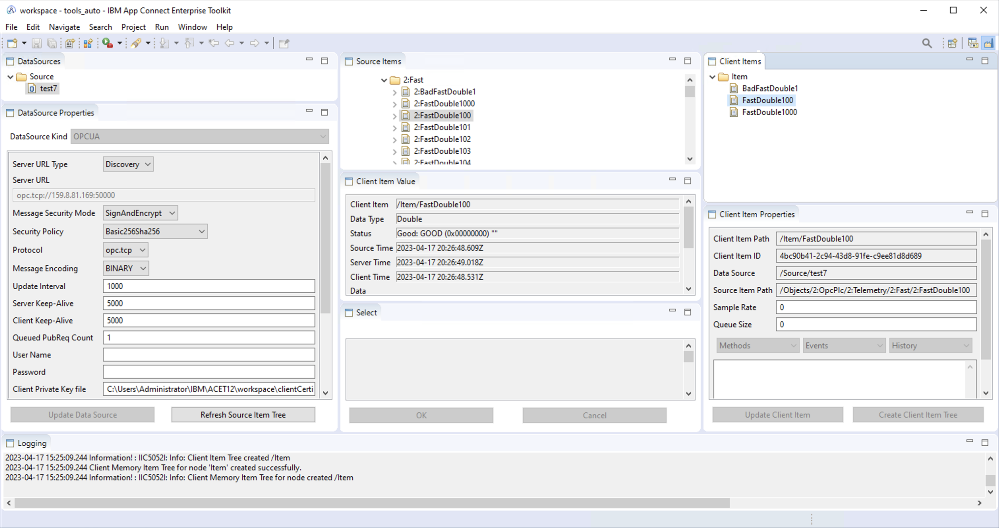

# Testing the IBM Manufacturing pack for IBM App Connect Enterprise
<!-- cspell:ignore PKCS unsecuretransport -->
## General


Ref: <https://github.ibm.com/client-engineering-france/mvp-lyfe-datacoll>

IBM ACE is available with an extension supporting the [OPC UA](https://en.wikipedia.org/wiki/OPC_Unified_Architecture) interface, as a client.

For testing purpose an OPC UA server (generating samples) is needed.
We can use the OPC PLC server.

The communication can be either un-encrypted (for tests only) or encrypted, but in that case X509 certificates must be put in place (both sides).


> **Note:** The `Makefile` is intended to be run on a Unix-like system (macOS, Linux)


In the following sections, `$HOME` refers to `%USERPROFILE%` on Windows.

A [IBM Performance Report](https://www.ibm.com/support/pages/ibm-app-connect-manufacturing-v20-performance-reports) for ACMfg is available.

## Security and Encryption

### Generation of Client Certificate

The OPCUA protocol requires mutual authentication and supports encryption.
Optionally, for tests, clear transmission can be used.

Prior to configuring the ACMfg, one needs to generate a certificate.

In production, Security will be used, this requires certificates on both the client and server.

The [ACE documentation](https://www.ibm.com/docs/en/app-connect/12.0?topic=source-generating-self-signed-ssl-certificate)
provides the steps to generate a self-signed certificate.

A `Makefile` is provided here to generate a simple self-signed certificate in the required format.
It simply follows the manual steps described in the documentation.

First initialize the config, execute:

```bash
make init
```

This creates the folder `private` and file `private/config.env`

Edit this file and fill specific information:

```bash
CLIENT_ADDRESS=192.168.0.100
SERVER_ADDRESS=192.168.0.101
PASSPHRASE=_your_passphrase_here_
```

Then generate the certificate and key:

```bash
make
```

Generated files are located in folder `build`:

- `clientCertificate.p12` : Private key and certificate protected by a password in a PKCS12 container.
- `clientCertificate.crt` : The certificate alone in PEM format.

### Comments on ACMfg documentation

A few comments on the ACE documentation:

- The ACE OPC UA client requires: The certificate's Private Key, the Key's passphrase, and the certificate.
- The documentation provides the steps to generate those. (used in the script)
- The documentation talks about "[PEM](https://en.wikipedia.org/wiki/Privacy-Enhanced_Mail)" format for both.
- The method proposed in documentation shows a PKCS12 container is generated.
- The UI tells, for the key: **Client Private Key in pem file (BASE64)**

In fact, the values to provide are:

- **Client Private Key file** : Expects the [PKCS12](https://fr.wikipedia.org/wiki/PKCS12) container, not PEM BASE64
- **Private Key password** : the password for the PKCS12 container
- **Client Certificate file** : The certificate in PEM format

If the key is not provided in the PKCS12 container, then the following error is logged:

```text
ERROR! IIC2037E: Caught exception when trying to load the client certificate and key from C:\...\clientCertificate.crt and C:\...\clientCertificate.key respectively, for data source /Source/xxx. stream does not represent a PKCS12 key store
```

The content of the PKCS12 container (with both the key and certificate) can be displayed with:

```bash
openssl pkcs12 -info -in build/clientCertificate.p12 -nodes -password pass:_pass_here_
```

## OPC PLC simulator server

In order to simulate the manufacturing side, a simulator can be used.
We use here the [OPC PLC server](https://github.com/Azure-Samples/iot-edge-opc-plc).

### Installation of client certificate

The current working directory in the container is : `/app`, as can be seen in the log:

```text
[INF] Current directory: /app
...
[INF] Application Certificate store path is: pki/own
...
[INF] Trusted Issuer Certificate store path is: pki/issuer
...
[INF] Trusted Peer Certificate store path is: pki/trusted
...
[INF] Rejected Certificate store path is: pki/rejected
```

So, the default folders used in the container are:

```text
/app
   /pki
      /own
      /issuer
      /trusted
      /rejected
```

If no server certificate is provided, the server generates a self signed certificate containing the hostname (of the container, so we fix the hostname value on container startup) in `/app/pki/own`.

On the podman host, in the user's home, we create a folder `pki` and copy the file `clientCertificate.crt` in it.

When the container is started, a volume is created to map this `pki` folder in the user's home to the `/app/pki` folder in the container.

The simulator is given the path to the client certificate (in the container) to add it to the trusted store.

This is automated here (copy startup script and certificate to podman host):

```bash
make deploy
```

### Startup

The startup script is provider for convenience: `start_opc.sh`

Several parameters are provided to allow unencrypted use, trust of client cert, fix the container hostname.

### Server certificate

Upon startup, the server will generate a self-signed certificate if none is already provided.

The server runs in the container, which has a hostname defaulting to the container id.
The CN of the certificate is generated with the hostname, but that hostname changes upon each start of the container (container id), this will make subsequent start fail due to the changing name.
A solution is to fix fix the container host name, so that the generated server certificate can be re-used.
(in case we need it on the client side).

## ACE Manufacturing

ACMfg provides a manufacturing view with the following tabs:

- `DataSources`
- `DataSource Properties`
- `Logging`
- `Source Items`
- `Client Item Value`
- `Select`
- `Client Items`
- `Client Item Properties`

### Creation of data source

In the `DataSources` tab is located the root source, named `Source`. This name can be changed.

Sources can be configured in a hierarchical manner, i.e. sub nodes can be created under the root node or another node.

Then any source node can be configured with a server connection: select the source and enter configuration in the `DataSource Properties` tab.



Sources configured with a server get a blue icon.

### Configuration of DataSource without Encryption

For testing purpose **only**, it is possible to register a source server without encryption and authentication.
This is much simpler than using certificates.

> **Note:** The configuration of the startup script `start_opc.sh` allows connection from client without encryption.
(option `--unsecuretransport`)

DataSource Properties:

- **Message Security Mode** : None
- **Security Policy** : None
- **Client Private Key file** : leave empty
- **Private Key password** : leave empty
- **Client Certificate file** : leave empty

### Configuration of DataSource with Encryption

Copy the generated files: `build/clientCertificate.crt` and `build/clientCertificate.p12` to the ACE workspace.

ACE Configuration:

- **Message Security Mode** : `SignAndEncrypt`
- **Security Policy** : `Basic256Sha256`
- **Client Private Key file** : `[path to workspace]/clientCertificate.p12`
- **Private Key password** : the password used for the PKCS12 container
- **Client Certificate file** : `[path to workspace]/clientCertificate.key`

The main folder for ACMfg is: `$HOME/.acmfg`

Upon configuration, the following file is generated: `$HOME/.acmfg/mappings/datasources.json`

> **Note:** Take a note of the data source mappingPath, e.g. `/Source/test7`: it will be needed later on to populate the vault with the PKCS12 password. It is the value of field `mappingPath` in `datasources.json`, noted `<source mappingPath>`.

### Issue: "Create Data Source" button greyed out

In some cases, the `Create Data Source` button in the ACE manufacturing view stays greyed out.

In this case:

1. Make sure you have created a data source in the folder above the data source properties, and that it is selected. Or un-select, and then select it again.

2. If that persists, close the toolkit, and restart. Eventually, the button shall be black.

### Server certificate on client

The ACE OPC UA client allows (for testing) to accept the server certificate manually:


### Preparation of mapping nodes

In the manufacturing view, follow these steps:

| Window Tab               | Action                          |
|--------------------------|---------------------------------|
| `DataSources`            | Select the data source          |
| `DataSource Properties`  | Check that it is properly configured and connected. Click on `Refresh Source Item Tree` |
| `Source Items`           | Check that items were retrieved.                                           |
| `Client Items`           | Select the element `Item`: it is the root item (it can be renamed).        |
| `Source Items`           | Navigate to Objects&rarr;OpcPlc&rarr;Telemetry. Select either a full section, or a list of source items, or a single item. |
| `Client Item Properties` | The button `Create Client Item Tree` becomes available (multiple selections), or `Create Client Item` (single selection). Click on the available button. |
| `Client Items`           | Note that items are now mapped. |



Upon configuration, the following file is generated: `$HOME/.acmfg/mappings/mapping_851eeb72-f996-4af4-8d63-d55c586c2826.json`

### Flow creation

As specified in the documentation, create one flow with both control nodes:


And a simple input flow can be:


To select sources for the OPC-UA-Input node follow this:

- in the connector configuration click on `Add`, this switches to the manufacturing view
- in `Client Items` select the desired items
- in `Select`, button `Add Trigger Item` is activated, click on it
- Eclipse switches back to the designer view.

## Integration Server

Create an Integration Server.
For example in the toolkit (development): in this case also create the vault with a password.

### ACMfg jars

The integration server (or node) needs to be equipped with the ACMfg jar.
This is described in the [documentation](https://www.ibm.com/docs/en/app-connect/12.0?topic=tasks-configuring-integration-server).
Edit `server.conf.yaml`, and configure like this (e.g on Windows):

```yaml
ConnectorProviders:
  ACMfg:
    connectorClassName: 'com.ibm.industrypack.industryclient.connector.ICConnectorFactory'
    jarsURL: 'C:/Program Files/IBM/ACMfg/3.0.1.1/runtime/amd64_nt_4'
    property1: 'trustCertificate=true;isHA=false'
```

> **Note:** Update the jar path accordingly to the actual version installed.

The property: `trustCertificate=true` means that an unknown certificate from a server will be automatically added to the list of accepted certificates.

### Vault and secrets

The integration server also needs the certificate and private key.
A vault must be used.
If the vault was not created when the IntegrationServer was created using toolkit, or of the IntegrationServer is remote.

See [documentation](https://www.ibm.com/docs/en/app-connect/12.0?topic=server-configuring-vault-enabled-integration)

The vault is created in the IntegrationServer work dir: `<workdirectory>/config/vault/store.yaml`


Open an ACE Console.

Example of workdir of IntegrationServer: `$HOME/IBM/ACET12/workspace/TEST_SERVER3`


On Unix-like systems, open a terminal.

```bash
mqsivault --work-dir <workdirectory> --create --vault-key <vaultkeyname>
```

Build the `<credentialname>` like this: `<source mappingPath>/acmfgPrivateKeyUser`, e.g. `/Source/test7/acmfgPrivateKeyUser`

> **Note:** The username parameter is not used.

```bash
mqsicredentials --work-dir <workdirectory> --vault-key <vaultkeyname> --create --credential-type ldap --credential-name <credentialname> --username not_used --password <PKCS12 password>
```

When the IntegrationServer is started it will look for that password based on `<source mappingPath>`.

The data source server information is read from `$HOME/.acmfg`, including the certificate, private key.

## ACE: Starting the integration server in a container

The idea here is to use the pre-built ACE container, and provide ACMfg jars in the mounted volume.
(Alternatively a new container image could be built.)

First, create a configuration file :

```bash
make conf_ace
```

Get your `entitlement_key` from [My IBM Product Services](https://myibm.ibm.com/products-services/containerlibrary)

Edit the file: `private/config_container.sh` and place your entitlement key and a secret for the IntegrationServer vault.

Deploy that to the VM where the container will be started:

```bash
make deploy_ace
```

Then, on the VM where podman will be used, load the tools:

```bash
for s in ace_container_{config,tools}.sh;do source $s;done
```

Login to IBM image repository

```bash
podman login cp.icr.io -u cp --password-stdin <<< $entitlement_key
```

### Work directory: Creation

- [Ref.: ACE Doc.: mqsicreateworkdir](https://www.ibm.com/docs/en/app-connect/12.0?topic=commands-mqsicreateworkdir-command)

Since we will mount an empty folder from the host, we must initialize the work directory for the Integration server using `mqsicreateworkdir`:

```bash
mkdir -p $host_work_directory
chmod 777 $host_work_directory
mqsicreateworkdir $container_work_directory
```

### Vault: Creation

- [Ref.: Youtube: Storing encrypted security credentials in a vault](https://www.youtube.com/watch?v=x78V_8k1P-M)
- [Ref.: ACE Doc.: mqsivault](https://www.ibm.com/docs/en/app-connect/12.0?topic=commands-mqsivault-command)
- [Ref.: ACE Doc.: mqsicredentials](https://www.ibm.com/docs/en/app-connect/12.0?topic=commands-mqsicredentials-command)

Two commands are used:

- `mqsivault` : create a vault
- `mqsicredentials` : manage credentials in vault

Let's create an empty vault in the `IntegrationServer` work dir:

```bash
mqsivault --work-dir $container_work_directory --create --vault-key $vault_key
```

> **Note:** Any operation on vault **can** be done while `IntegrationServer` is stopped. When `IntegrationServer` is stopped the vault key **must** be provided on command line (option `--vault-key $vault_key`).
>
> **Note:** Some operations **must** be done while `IntegrationServer` is stopped: Creation of vault, deletion of entry.
>
> **Note:** Some operations on vault **can** be done while `IntegrationServer` is running: List entries, Add entry. When `IntegrationServer` is running the vault key is not needed on command line: Requests are made through the `IntegrationServer`.

### ACE: Add Private Key password

Credentials (username/password, and sometimes client id and secret) are sensitive pieces of information.
A good practice is to store them in a safe location.
ACE provides several ways to store credentials:

| provider          | description                                   |
|-------------------|-----------------------------------------------|
| vault             | in an encrypted vault                         |
| servercredentials | statically in the server's configuration file |
| setdbparms        | in a parameter storage                        |

Use the same command as previously with local server:

```bash
mqsicredentials \
--work-dir $container_work_directory \
--vault-key $vault_key \
--create \
--credential-type ldap \
--credential-name $source_path/acmfgPrivateKeyUser \
--username not_used \
--password "$pkcs12_key"
```

### ACE: Start container

- [Ref.: ACE Doc.: IntegrationServer command](https://www.ibm.com/docs/en/app-connect/12.0?topic=commands-integrationserver-command)

Several ports are to be published to allow access to the Integration Server:

| port  | Usage                                      |
|-------|--------------------------------------------|
| 7600  | Integration server web and management port |
| 7700  | Integration server debug port              |
| 7800  | Integration server user API port           |
| 7843  | Integration server port with TLS           |

```bash
podman run \
--detach \
--name aceserver \
--env LICENSE=accept \
--publish 7600:7600 \
--publish 7700:7700 \
--publish 7800:7800 \
--publish 7843:7843 \
--volume $host_work_directory:$container_work_directory \
--entrypoint=bash \
$ace_image \
-l -c \
"IntegrationServer --work-dir $container_work_directory --vault-key $vault_key"
```

> **Note:** The container default entry point is overridden to allow additional arguments to be passed to the integration server (e.g. vault key).
(It could also be provided through an environment variable, but not all options are available in env vars.)
>
> **Note:** The vault key may also be provided through an env var, or through a RC file. (Refer to the `IntegrationServer` manual)

